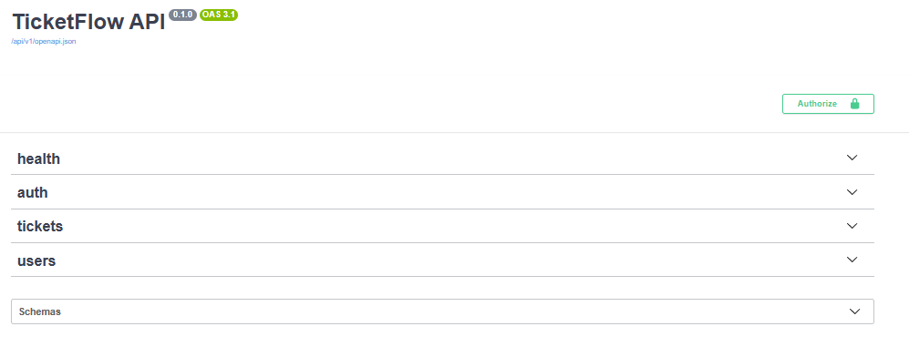
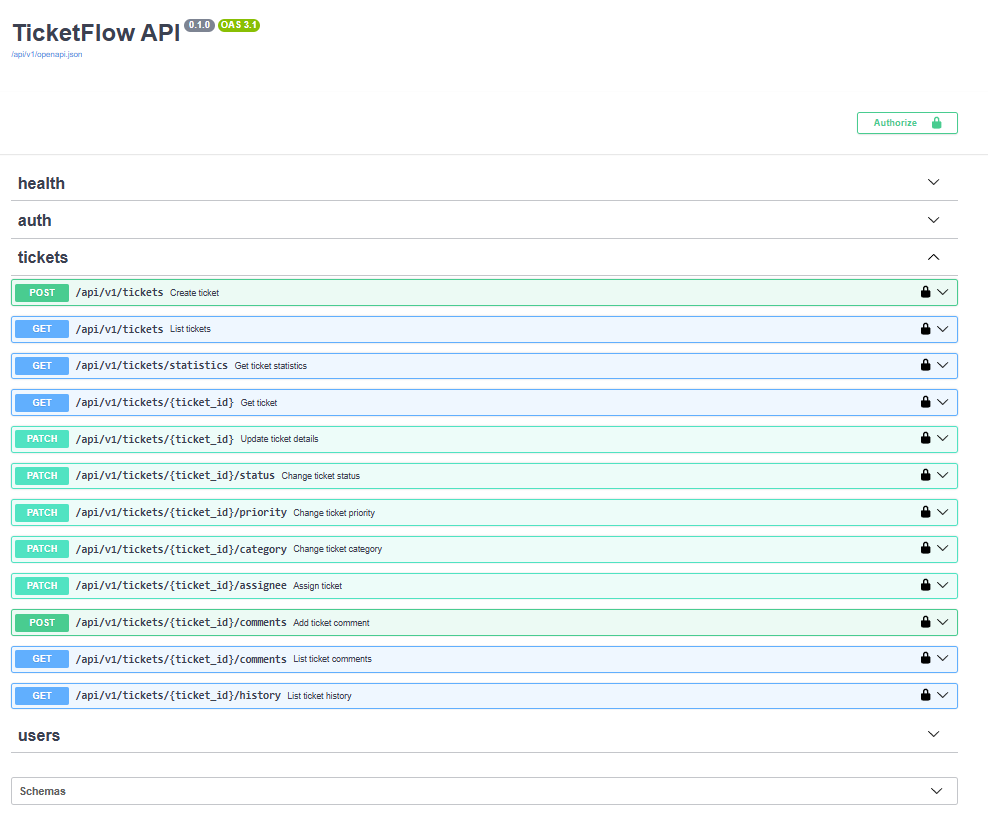
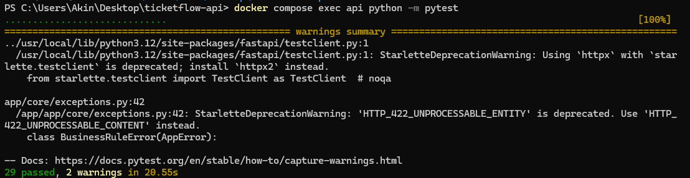
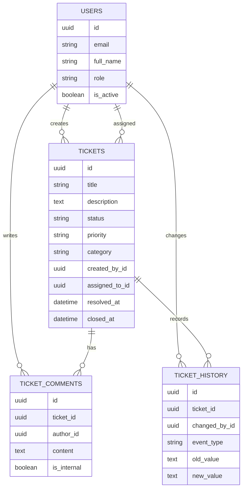
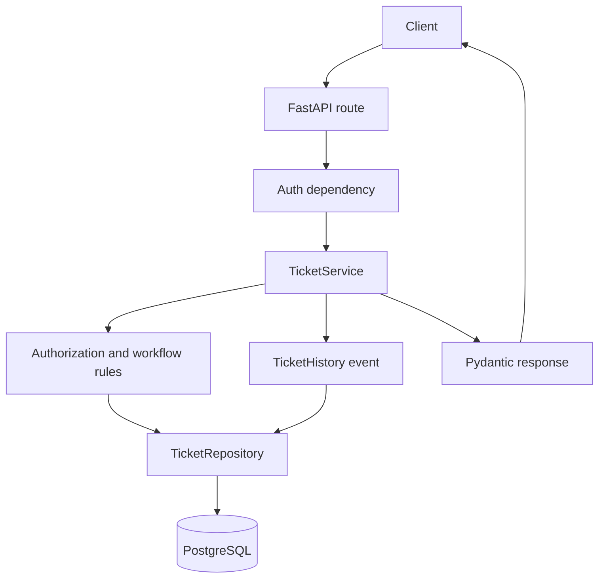

# TicketFlow API

TicketFlow API is a production-style FastAPI backend for support ticket management. It turns a reusable backend template into a focused portfolio project with authentication, role-based authorization, PostgreSQL persistence, Alembic migrations, and a tested ticket workflow.

## Screenshots

### Swagger API Documentation



### Ticket Management Endpoints



### Automated Test Results



## Features

- JWT authentication with active user checks
- User and admin roles
- Ticket creation, filtering, pagination, search, and statistics
- Admin assignment to active admins only
- Public and internal ticket comments
- Ticket history audit trail for creation, updates, comments, assignment, priority, and status changes
- Structured JSON error responses
- Health endpoints for app and database checks
- Docker Compose local stack
- Ruff, mypy, pytest, Alembic, and GitHub Actions

## Architecture

TicketFlow keeps HTTP handlers thin and places domain behavior in services.

- `app/api/routes`: FastAPI routers and request dependency wiring
- `app/api/dependencies`: auth and database dependencies
- `app/models`: SQLAlchemy 2.x ORM models and enums
- `app/schemas`: Pydantic v2 request and response schemas
- `app/repositories`: database query, filtering, counting, and persistence helpers
- `app/services`: authorization, workflow validation, timestamps, assignment rules, and history creation
- `alembic/versions`: database migrations
- `tests`: unit and integration coverage

## Stack

- Python 3.12+
- FastAPI
- PostgreSQL
- SQLAlchemy 2.x
- Alembic
- Pydantic v2
- PyJWT and bcrypt password hashing
- Docker and Docker Compose
- Ruff, mypy, pytest

## Entities

- `User`: authenticated account with `USER` or `ADMIN` role and active status
- `Ticket`: support request with status, priority, category, creator, optional assignee, and lifecycle timestamps
- `TicketComment`: public or admin-only internal discussion on a ticket
- `TicketHistory`: immutable audit event for important ticket changes

## Ticket Lifecycle

Admin transitions:

- `OPEN -> IN_PROGRESS`
- `OPEN -> RESOLVED`
- `IN_PROGRESS -> WAITING_FOR_CUSTOMER`
- `IN_PROGRESS -> RESOLVED`
- `WAITING_FOR_CUSTOMER -> IN_PROGRESS`
- `WAITING_FOR_CUSTOMER -> RESOLVED`
- `RESOLVED -> OPEN`
- `RESOLVED -> CLOSED`
- `CLOSED -> OPEN`

Normal users may only reopen their own resolved ticket:

- `RESOLVED -> OPEN`

Timestamp behavior:

- Moving to `RESOLVED` sets `resolved_at`
- Reopening from `RESOLVED` clears `resolved_at`
- Moving to `CLOSED` sets `closed_at`
- Reopening from `CLOSED` clears `closed_at`

## Authorization Rules

Normal users can:

- Create tickets
- List and view only their own tickets
- Update title and description only while a ticket is `OPEN`
- Add public comments to their own tickets
- Reopen their own `RESOLVED` ticket to `OPEN`

Normal users cannot assign tickets, change priority/category, view history, view internal comments, close tickets, or access another user's ticket.

Admins can:

- List and view all tickets
- Update ticket details, priority, category, and status
- Assign tickets to active admins
- Add public or internal comments
- View ticket history
- Resolve, close, and reopen tickets

## Local Setup With PowerShell

```powershell
python -m venv .venv
.\.venv\Scripts\Activate.ps1
python -m pip install --upgrade pip
python -m pip install -r requirements.txt
Copy-Item .env.example .env
```

Edit `.env` for your local database and JWT secret, then run migrations:

```powershell
python -m alembic upgrade head
python -m uvicorn app.main:app --reload
```

Open:

- API docs: `http://127.0.0.1:8000/docs`
- Health: `http://127.0.0.1:8000/health`
- Database health: `http://127.0.0.1:8000/api/v1/health/database`

## Docker Usage

```powershell
docker compose up --build
```

Validate the compose file:

```powershell
docker compose config
```

## Migrations

Create a migration after model changes:

```powershell
python -m alembic revision --autogenerate -m "describe change"
```

Apply migrations:

```powershell
python -m alembic upgrade head
```

Inspect migration state:

```powershell
python -m alembic heads
python -m alembic history
```

## Tests And Quality

```powershell
python -m ruff check .
python -m ruff format --check .
python -m mypy app
python -m pytest
python -m alembic heads
python -m alembic history
docker compose config
```

## API Endpoint Summary

Authentication:

- `POST /api/v1/auth/register`
- `POST /api/v1/auth/login`
- `GET /api/v1/auth/me`

Users:

- `GET /api/v1/users`
- `GET /api/v1/users/{user_id}`
- `PATCH /api/v1/users/{user_id}`
- `DELETE /api/v1/users/{user_id}`

Tickets:

- `POST /api/v1/tickets`
- `GET /api/v1/tickets`
- `GET /api/v1/tickets/statistics`
- `GET /api/v1/tickets/{ticket_id}`
- `PATCH /api/v1/tickets/{ticket_id}`
- `PATCH /api/v1/tickets/{ticket_id}/status`
- `PATCH /api/v1/tickets/{ticket_id}/priority`
- `PATCH /api/v1/tickets/{ticket_id}/category`
- `PATCH /api/v1/tickets/{ticket_id}/assignee`
- `POST /api/v1/tickets/{ticket_id}/comments`
- `GET /api/v1/tickets/{ticket_id}/comments`
- `GET /api/v1/tickets/{ticket_id}/history`

Health:

- `GET /health`
- `GET /api/v1/health/database`

## Filtering Examples

List high-priority technical tickets:

```powershell
Invoke-RestMethod `
  -Uri "http://127.0.0.1:8000/api/v1/tickets?priority=HIGH&category=TECHNICAL" `
  -Headers @{ Authorization = "Bearer $token" }
```

Search title and description, newest first:

```powershell
Invoke-RestMethod `
  -Uri "http://127.0.0.1:8000/api/v1/tickets?q=billing&sort_by=created_at&sort_dir=desc" `
  -Headers @{ Authorization = "Bearer $token" }
```

Supported ticket list filters:

- `status`
- `priority`
- `category`
- `assigned_to_id`
- `created_by_id`
- `is_assigned`
- `created_from`
- `created_to`
- `q`
- `sort_by`: `created_at`, `updated_at`, `priority`, `status`
- `sort_dir`: `asc`, `desc`

Normal users are always scoped to their own tickets, even when they pass broader filters.

## Auth Examples

Register:

```powershell
Invoke-RestMethod `
  -Method Post `
  -Uri "http://127.0.0.1:8000/api/v1/auth/register" `
  -ContentType "application/json" `
  -Body '{"email":"customer@example.com","password":"StrongPassword123","full_name":"Customer User"}'
```

Log in and store the bearer token:

```powershell
$login = Invoke-RestMethod `
  -Method Post `
  -Uri "http://127.0.0.1:8000/api/v1/auth/login" `
  -ContentType "application/json" `
  -Body '{"email":"admin@example.com","password":"StrongPassword123"}'

$token = $login.access_token
```

Create a ticket:

```powershell
Invoke-RestMethod `
  -Method Post `
  -Uri "http://127.0.0.1:8000/api/v1/tickets" `
  -Headers @{ Authorization = "Bearer $token" } `
  -ContentType "application/json" `
  -Body '{"title":"Cannot export invoice","description":"The invoice export returns a blank PDF.","priority":"HIGH","category":"BILLING"}'
```

## Seed And Demo Credentials

Seed demo data:

```powershell
python -m scripts.seed
```

Demo credentials:

- Admin: `admin@example.com` / `StrongPassword123`
- User: `user@example.com` / `StrongPassword123`
- User: `jane@example.com` / `StrongPassword123`

The seed creates assigned and unassigned tickets, public comments, internal comments, and history entries.

## CI

GitHub Actions is configured to run project quality checks for pull requests and pushes. The intended verification set is:

- Ruff lint
- Ruff format check
- mypy
- pytest
- Alembic metadata/history checks

## Security Notes

- Passwords are hashed before storage.
- JWTs use a configurable secret from environment variables.
- Inactive users cannot authenticate.
- Normal users are always scoped to their own tickets at the service layer.
- Internal comments and ticket history are admin-only.
- Closed tickets are immutable except for explicit reopen transitions.
- Do not commit production secrets in `.env`.

## Future Improvements

- SLA timers and breach reporting
- Email or webhook notifications
- Attachment storage for ticket evidence
- Saved views for support teams
- Full-text PostgreSQL search
- WebSocket updates for live ticket activity

## ER Diagram



## Request Flow


